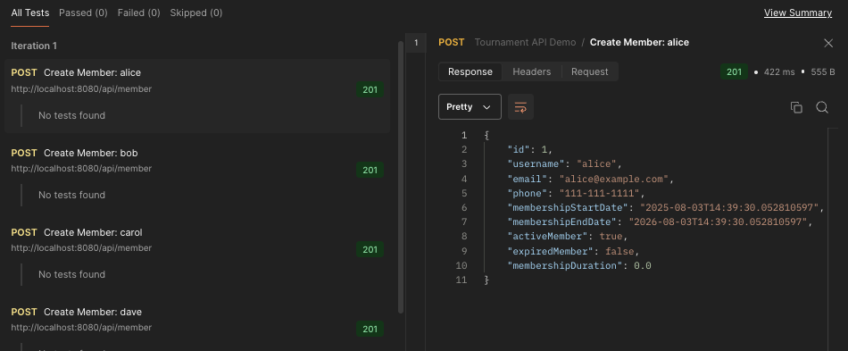
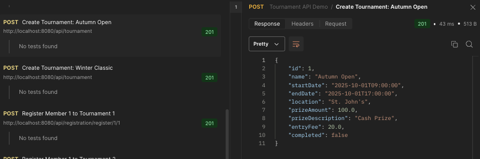
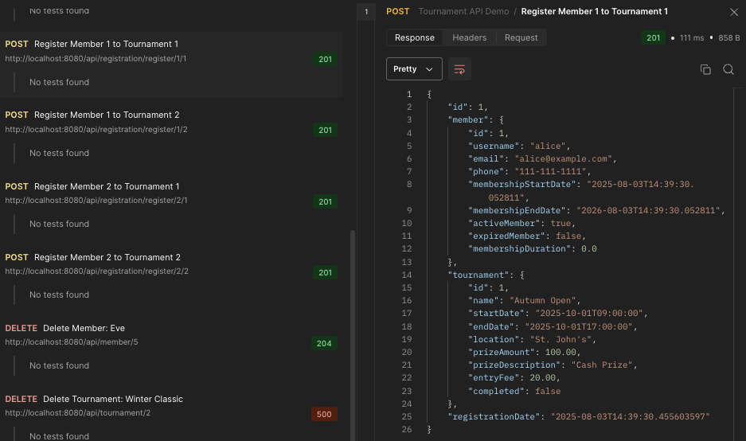
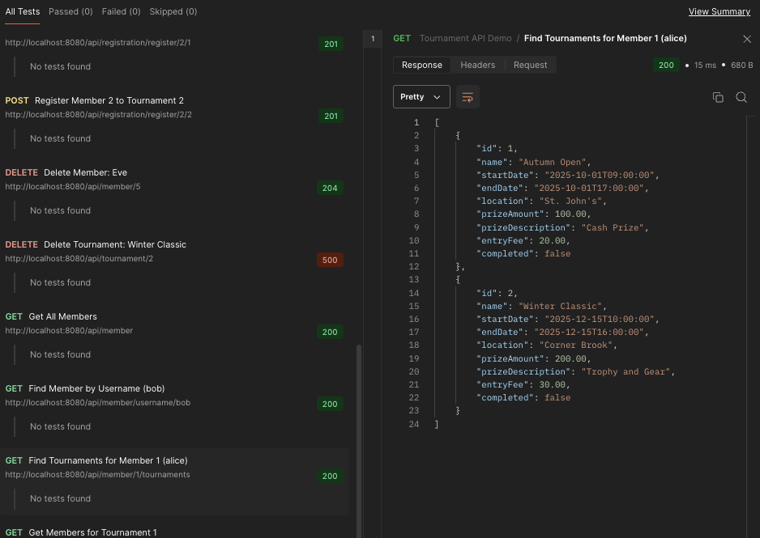
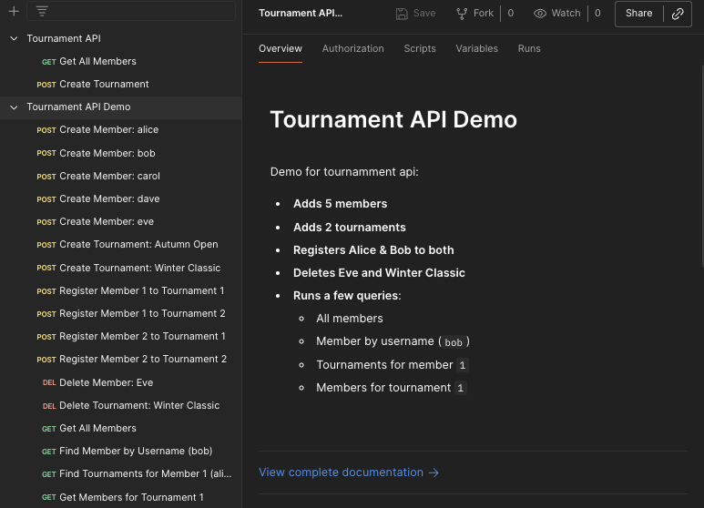
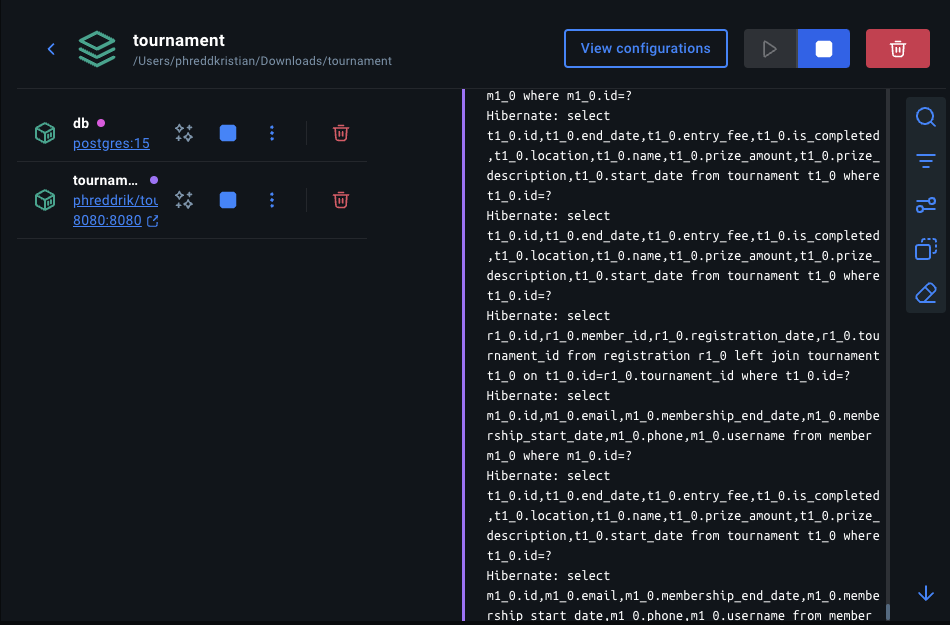

# TeeParty Golf Club Tournament & Membership API

This project is a full-featured REST API for managing **golf club members** and **tournaments**, built using **Java**, **Spring Boot**, **Spring Data JPA**, and **Docker**. It demonstrates solid Object-Relational Mapping (ORM), RESTful patterns, and containerization practices.

The API supports creating, reading, updating, and deleting members and tournaments, registering members to tournaments, and performing advanced searches on both entities.

---

## Supported Search Endpoints

### Member Endpoints

| Endpoint | Description |
|----------|-------------|
| `GET /api/member` | Get all members |
| `GET /api/member/{id}` | Get member by ID |
| `GET /api/member/username/{username}` | Search member by username |
| `GET /api/member/email/{email}` | Search member by email |
| `GET /api/member/phonenumber/{phoneNumber}` | Search member by phone number |
| `GET /api/member/startdate?startDate=YYYY-MM-DDTHH:mm:ss` | Search members by exact membership start date |
| `GET /api/member/startdate/before?startDate=...` | Search members by start date before a given date |
| `GET /api/member/enddate?endDate=...` | Search members by membership end date |
| `GET /api/member/active` | List all active members |
| `GET /api/member/expired` | List all expired members |
| `GET /api/member/{memberId}/tournaments` | List tournaments a member is registered for |

### Tournament Endpoints

| Endpoint | Description |
|----------|-------------|
| `GET /api/tournament` | Get all tournaments |
| `GET /api/tournament/{id}` | Get tournament by ID |
| `GET /api/tournament/{id}/members` | List members registered to a tournament |

### Registration Endpoints

| Endpoint | Description |
|----------|-------------|
| `POST /api/registration/register/{memberId}/{tournamentId}` | Register a member for a tournament |
| `DELETE /api/registration/unregister/{memberId}/{tournamentId}` | Unregister a member from a tournament |

---
## Development and Testing

- This branch supports API testing with **Postman** or other tools (see images below).
- A <a href="postman/teeparty-collection.json">Postman collection</a> is available to test endpoints

<p align="center">
  
</p>

<p align="center">
  
</p>

<p align="center">
  
</p>

<p align="center">
  
</p>

Example collection run:
<p align="center">
  <a href="postman/teeparty-collection.json">
    
  </a>
</p>

---
## How to Run This Project in Docker

Example of project running in Docker: 

<p align="center">
    
</p>

### Prerequisites
- Docker
- Docker Compose

### Quick Start

1. **Clone the repository**  
   ```bash
   git clone https://github.com/your-username/golf-tournament-api.git
   cd golf-tournament-api
   ```

2. **Run the app using Docker Compose**  
   ```bash
   docker-compose up --build
   ```

   This will:
   - Build the Spring Boot app
   - Start a PostgreSQL container
   - Connect them inside a shared Docker network

3. **Access the API**  
   Visit [http://localhost:8080/api/member](http://localhost:8080/api/member) or [http://localhost:8080/api/tournament](http://localhost:8080/api/tournament)

---

## Database Default Credentials

| Key | Value |
|-----|-------|
| URL | `jdbc:postgresql://db:5432/tournamentdb` |
| User | `postgres` |
| Password | `KeyinSD12` |

You can modify these in `docker-compose.yml` or use environment variables.

---

## Tech Stack

- Java 24
- Spring Boot 3.5
- Spring Data JPA (Hibernate)
- PostgreSQL 15
- Docker + Docker Compose

---

## Coming Soon

- Switch to RDS for production
- Deployable version on AWS

---
